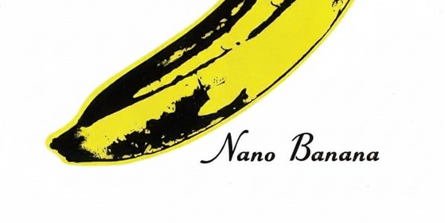

# Nano Banana 48 Hour Challenge: Official Toolkit 🍌

  

Welcome, hackers! This repository is the official starter kit and resource hub for the [**Nano Banana 48 Hour Challenge**](https://www.kaggle.com/competitions/banana), hosted by **Google DeepMind**. Everything you need to get started, build something incredible, and submit your project is right here.

**Go Bananas!** For 48 hours, starting **September 6, 2025**, we are unlocking an expanded free tier of the Gemini API, putting **Gemini 2.5 Flash Image Preview** (aka Nano Banana) into your hands. We challenge you to build an application that leverages its unique capabilities to solve a creative, commercial, or educational problem.

### Quick Navigation

- [Nano Banana 48 Hour Challenge: Official Toolkit 🍌](#nano-banana-48-hour-challenge-official-toolkit-)
    - [Quick Navigation](#quick-navigation)
  - [🚀 Get Started in 3 Steps](#-get-started-in-3-steps)
  - [🛠️ Technical Resources](#️-technical-resources)
    - [In This Repository](#in-this-repository)
    - [External Resources \& Links](#external-resources--links)
  - [🏆 Submission \& Judging](#-submission--judging)
    - [How to Submit](#how-to-submit)
    - [Submission Requirements](#submission-requirements)
    - [Judging Criteria](#judging-criteria)
  - [🗓️ Timeline \& Prizes](#️-timeline--prizes)
    - [💰 Prizes](#-prizes)
    - [⏳ Key Dates](#-key-dates)
  - [💬 Getting Help \& Discussion](#-getting-help--discussion)

## 🚀 Get Started in 3 Steps

1.  **Get Your Free API Key**
    *   Follow the **[API Key Guide](./guides/01-getting-your-api-key.md)** included in this repo to get your exclusive access to the Gemini API. This is only available for the 48-hour competition window!

2.  **Explore the Resources**
    *   Clone this repository to access the starter kits and code examples. Then, check out the external links for inspiration and documentation.

3.  **Submit Your Project on Kaggle**
    *   When you're ready, head over to the **[Official Kaggle Competition Page](https://www.kaggle.com/competitions/banana)** to submit your project before the deadline.

## 🛠️ Technical Resources

This section is divided into what you'll find inside this repository and essential external links.

### In This Repository
*   **[./examples/01-getting-your-api-key.ipynb](./examples/01-getting-your-api-key.ipynb)**: **(START HERE)** Step-by-step instructions to get your free Gemini API key and generate a first image with nano banana using Python.
*   **[`starter-kits/`](./starter-kits/)**: Ready-to-use project templates to get you building immediately.
*   **[`examples/`](./examples/)**: Self-contained code snippets demonstrating specific features of the Gemini API.
    *  [JavaScript Getting Started](./examples/javascript-getting-started.md)

### External Resources & Links
*   🌐 **Official Nano Banana Gemini API Docs**: https://ai.google.dev/gemini-api/docs/image-generation
*   ✍️ **Prompting Guide & Strategies**: https://ai.google.dev/gemini-api/docs/image-generation#prompt-guide
*   🍳 **Cookbooks (Advanced Recipes)**:
    *   **Python**: [Quickstart with Image understanding (Colab)](https://colab.research.google.com/github/google-gemini/cookbook/blob/main/quickstarts/Image_out.ipynb)
    *   **JavaScript**: [Get Started with Image understanding (AI Studio)](https://aistudio.google.com/apps/bundled/get_started_image_out)
*   ✨ **Inspirational Applets**: See what's possible with these interactive demos.
    *   [GemBooth](https://aistudio.google.com/apps/bundled/gembooth)
    *   [Home Canvas](https://aistudio.google.com/apps/bundled/home_canvas)
    *   [Past Forward](https://aistudio.google.com/apps/bundled/past_forward)
    *   [PixShop](https://aistudio.google.com/apps/bundled/pixshop)

## 🏆 Submission & Judging

Your project will be judged primarily on your video demo. Show, don't just tell! We want to see the "wow" factor and the utility of your application.

### How to Submit
All submissions must be made through the official competition page:
> **[https://www.kaggle.com/competitions/banana](https://www.kaggle.com/competitions/banana)**

### Submission Requirements
Your complete Kaggle submission must include:

1.  **🎥 The Video Demo (2 minutes or less)**
    *   An engaging video demonstrating your project. It must be posted publicly (e.g., YouTube, X/Twitter) and viewable without a login.

2.  **🔗 Public Project Link**
    *   A URL to your working product or interactive demo. If a live demo isn't feasible, a link to your public code repository (e.g., GitHub) with clear setup instructions is required.

3.  **✍️ Gemini Integration Write-up (max 200 words)**
    *   A brief description detailing which Gemini 2.5 Flash Image features you used and how they are central to your application.

### Judging Criteria
*   💡 **Innovation & "Wow" Factor**: How creative and novel is the application?
*   ⚙️ **Technical Execution**: Does the app work? How effectively does it use advanced API features?
*   📈 **Potential Impact & Utility**: Does it solve a real-world problem (creative, commercial, or educational)?
*   🎬 **Presentation Quality**: Clarity, storytelling, and engagement of the video demo.

## 🗓️ Timeline & Prizes

### 💰 Prizes
Compete for your share of over **$250,000 in prizes**!
*   **Top 50 Submissions**: Receive **$5,000 in Google AI API Credits** each.
*   Additional track awards and prizes will be detailed on the Kaggle page.

### ⏳ Key Dates
*   **Competition Starts**: September 6, 2025
*   **Final Submission Deadline**: September 7, 2025 (11:59 PM UTC)
*   **Judging Period**: September 8 - 12, 2025
*   **Winners Announced**: September 15, 2025 (Estimated)

*All deadlines are at 11:59 PM UTC. The organizers reserve the right to update the timeline.*

## 💬 Getting Help & Discussion

All questions, team formation, and discussions will take place on the Kaggle platform. This is the best place to get help from organizers, mentors, and the community.

*   **Ask a question:** Post your technical or general questions for the community and organizers.
*   **Find teammates:** Create a post to look for collaborators.
*   **Share your ideas:** Discuss your project concepts and get feedback.

> **[Go to the Official Kaggle Discussion Forum](https://www.kaggle.com/competitions/banana/discussion)**

Happy Hacking!